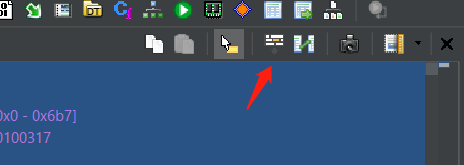
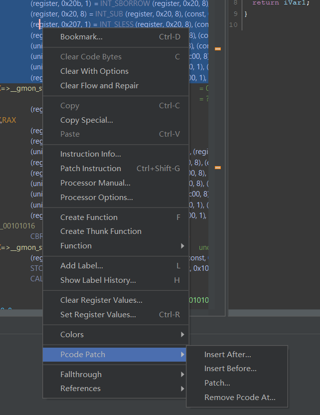

# Pcode Patching

Pcode patching is about modifying the pcode generated by Ghidra in the first place.

By modifying those, you are able to introduce your own semantic without changing any
of the actual bytes which is required when patching with assemblies.

Current pcode patching can be used both with or without UI.

## With UI

First, you need to enable the pcode display. This can be done by:

1. open up "edit the listing fields"



2. select `Instruction/Data`, double click `PCode` field.


3. Close the "editing the listing fields" by click that button again. (the button in step 1)

It's recommended to enable raw pcode format when displaying. When patching, this
is the only acceptable format (at least for now.)

This can be done in:

`Edit` -> `Tool Options` -> `Listing Fields` -> `Pcode Field` -> `Display Raw Pcode`

Enable it.

To patch the IR, you can right click on any pcode you'd like to:

- modify
- insert before
- insert after
- remove



After click the one you want, you might get a new window poping up for exact pcode you want (except for remove).

Input the pcode instruction in raw format. The format is:

- Varnode: `(space_name, offset, size)`. For example, `(register, 0, 0)`
- Pcode: `output_varnode = OPCODE INPUT_VARNODE1, INPUT_VARNODE2, ...`. For example, `(unique, 0, 8) = INT_ADD (unique, 8, 8), (const, 8, 8)`.

The `unique` space is normally used for temporary vars. Opcode should be in uppercase (we might also allow lower case as well in the future).

The full list of the opcode can be refer to the [ghidra's official pcode reference](https://ghidra.re/courses/languages/html/pcoderef.html).

## Without UI

You can also use pcode patching with script. To do this, what you need:

1. get the instruction you wish to patch.
2. construct the `RawPcode` array, which can be both the original pcode or the pcode you specify yourself. Also,
you might find `PcodeRawParser` useful to generate `RawPcode`.
3. call `inst.patchPcode(array_of_raw_pcode)` to patch it.

Note that the patched pcode is correspond to the instruction. That means, once the instruction is undefined,
the pcode you patched is gone as well.

An example of Jython script of patch the pcode:

```Python
from array import *
from ghidra.program.model.pcode import RawPcode, RawPcodeImpl, PcodeOp, Varnode, PcodeRawParser

address_factory = currentProgram.getAddressFactory()
inst = getInstructionAt(address_factory.getAddress('0x101001'))
# Goal: patch pcode `(unique, 0, 8) = COPY (const, 8, 8)` to this instruction

# option 1: construct raw pcode yourself
unique_space = address_factory.getAddressSpace('unique')
const_space = address_factory.getAddressSpace('const')

inputs = array(Varnode, [Varnode(const_space.getAddress('0x8'), 8)]) # inputs -> (const, 8, 8)
output = Varnode(unique_space.getAddress('0x0', 8)) # output -> (unique, 0, 8). This can also be None, for example in BRANCH opcode.
pcode = RawPcodeImpl(PcodeOp.COPY, inputs, output)
patch_pcode = array(RawPcode, [pcode]) # we need an array to patch
inst.patchPcode(pcode) # patch the pcode! Note that this will TOTALLY OVERRIDE that instruction's pcode.


# option 2: use the parser, so we can use the same syntax as with UI
patch_pcode = PcodeRawParser.parseRawPcode(address_factory, '(unique, 0, 8) = COPY (const, 8, 8)')
inst.patchPcode(pcode)
```